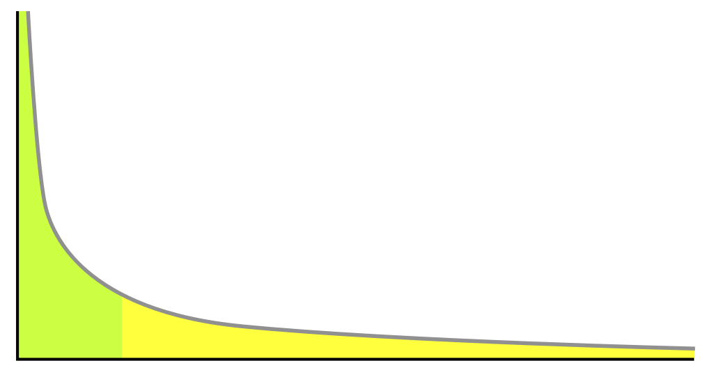

```{r setup, include=FALSE}
knitr::opts_chunk$set(echo = FALSE, fig.align = 'center', message=FALSE, warning=FALSE, out.width="70%", out.height = "70%", fig.pos = "H")
```
\newpage

# Introduction

High performing employees are the investment of companies in their success and growth in future. Therefore it's important for businesses to find out about factors that are contributing more to employee attrition.

In this report, we'll try to find out which employees tend to leave the company, what factors are the stronger contributors to this behavior, which departments face the attrition problem and what type of measures could the company take in order to retain their employees.

The purpose of this project is to investigate the employee attrition of a company and predicting the potential employees who would leave the company. We will be working with a dataset extracted from [Kaggle](https://www.kaggle.com/datasets/pavansubhasht/ibm-hr-analytics-attrition-dataset) called "IBM HR Analytics Employee Attrition & Performance".

To do this all, first we'll do some EDA (Explanatory Data Analysis) to get some intuition about the data. We then try to build different models with different techniques and compare their scores with different evaluation metrics. We finally fine tune our model in the best performing technique.


```{r Data Loading, include=FALSE}
if(!require(tidyverse)) install.packages("tidyverse") 
if(!require(tidyr)) install.packages("tidyr")
if(!require(caret)) install.packages("caret")
if(!require(kableExtra)) install.packages("kableExtra")
if(!require(ggplot2)) install.packages("ggplot2")
if(!require(purrr)) install.packages("purrr")
if(!require(cleandata)) install.packages("cleandata")
if(!require(gridExtra)) install.packages("gridExtra")
if(!require(pROC)) install.packages("pROC")
if(!require(randomForest)) install.packages("randomForest")
if(!require(gbm)) install.packages("gbm")

# Libraries we need
library(tidyverse)
library(caret)
library(kableExtra)
library(purrr)
library(corrplot)
library(cleandata)
library(gridExtra)
library(ROSE)
library(pROC)
library(randomForest)
library(gbm)

filename <- "WA_Fn-UseC_-HR-Employee-Attrition.csv"
employees <- read.csv(filename)
```

\newpage
# Exploratory Data Analysis
We start the exploratory data analysis (EDA) to discover some patterns and correlations in data that may notice us why the employees stay in the company or leaves it.

First of all, we take a look at the dataset structure and make a statistical summary of the features that are into it.

## Data Structure
```{r Employees Structure, include=FALSE}
str(employees)
```
After *str(employee)*, we know that features in the dataset are:

-   **Age** `<integer>` that contains the age for each employee.
-   **Attrition** `<character>` that contains if the employee stay at the company or leaves it *(target feature)*.
-   **BussinesTravel** `<character>` that contains the travel frequency for each employee.
-   **DailyRate** `<integer>` that contains the daily rate.
-   **Department** `<character>` that contains the department for each employee.
-   **DistanceFromHome** `<integer>` that contains the distance from home for each employee. 
-   **Education** `<integer>` that contains the education grade for each employee.
-   **EducationField** `<character>` that contains the education field for each employee.
-   **EmployeeCount** `<integer>` 
-   **EmployeeNumber** `<integer>` that contains the id number for each employee.
-   **EnvironmentSatisfaction** `<integer>` that contains the environment satisfaction for each employee.
-   **Gender** `<character>` that contains if the employee is male or female.
-   **HourlyRate** `<integer>` that contains the hourly rate for each employee.
-   **JobInvolvement** `<integer>` that contains the job involvement for each employee.
-   **JobLevel** `<integer>` that contains the job level for each employee.
-   **JobRole** `<character>` that contains the job role for each employee.
-   **JobSatisfaction** `<integer>` that contains the job satisfaction for each employee.
-   **MaritalStatus** `<character>` that contains if the employee is married, single or divorced.
-   **MonthlyIncome** `<integer>` that contains the monthly income for each employee.
-   **MonthlyRate** `<integer>` that contains the monthly rate for each employee.
-   **NumCompaniesWorked** `<character>` that contains the number of companies in which an employee works.
-   **Over18** `<character>` that contains if the employee is eighteen years or more.
-   **OverTime** `<character>` that contains if the employee do overtime hours.
-   **PercentSalaryHike** `<integer>` that contains if the employee.
-   **PerformanceRating** `<integer>` that contains the performance rating for each employee.
-   **RelationshipSatisfaction** `<integer>` that contains the satisfaction rating on employee relations at the company. 
-   **StandardHours** `<integer>` that contains the standard hours for each employee.
-   **StockOptionLevel** `<integer>` that contains the level of some employees that are paid with company stocks. (0 if not)
-   **TotalWorkingYears** `<integer>` that contains the amount of years each employee worked.
-   **TrainingTimesLastYear** `<integer>` that contains the number of times the employee is trained.
-   **WorkLifeBalance** `<integer>` that contains the work-life balance for each employee.
-   **YearsAtCompany** `<integer>` that contains the number of years the employee worked at the company.
-   **YearsInCurrentRole** `<integer>` that contains the number of years in current role for each employee.
-   **YearsSinceLastPromotion** `<integer>` that contains the number of years since the last promotion for each employee.
-   **YearsWithCurrManager** `<integer>` that contains the number of years the employee worked with the same manager (current manager).


```{r To Plot better, include=FALSE}
# Change "Yes" and "No" into numbers (1 and 0). To plot better.
employees$Over18 <- ifelse(employees$Over18 == "Y", 1, 0)
employees$OverTime <- ifelse(employees$OverTime == "Yes", 1, 0)
```

## Missing Values
Continuing with the data exploration we need to know if the dataset has missing values and how many values different are in each feature. In case of missing data we have to find the best approach to fill it.

```{r Missing Values, echo=FALSE}
sapply(employees, function(x) sum(is.na(x))) %>%
  kable(caption = "Missing Values", booktabs = T) %>% 
   kable_paper(position = "center", latex_options = "HOLD_position", full_width = F , font_size = 10) %>%
  column_spec(1, color = "black", bold = TRUE) %>%
  row_spec(0, color = "black", bold = TRUE) 
```

We are lucky, we don't have missing values! So let's continue.

```{r N of Unique Values, echo=FALSE}
# Counting the number of unique values of each feature
sapply(employees, function(x) n_distinct(x)) %>%
  kable(caption = "Number of Unique Values", booktabs = T) %>% 
   kable_paper(position = "center", latex_options = "HOLD_position", full_width = F , font_size = 10) %>%
  column_spec(1, color = "black", bold = TRUE) %>%
  row_spec(0, color = "black", bold = TRUE)
```

The following columns are "no use" variables; they does not add values to the predictive model that I am going to build:

 1. EmployeeNumber (1470 unique values)
 
 2. EmployeeCount (only 1 unique value)
 
 3. Over18 (only 1 unique value)
 
 4. StandardHours (only 1 unique value)

Our first plot will be a global map on all the variables, to take reference on the characteristics of the variables and their distributions. Let's start!

## Histogram plots
```{r Printing histograms for all Numerical Features, echo=FALSE, fig.height= 10,fig.width=10, fig.cap = "Histogram of All Numerical Features"}
# Printing all numerical features
employees %>% mutate(Attrition = ifelse(Attrition== "Yes", 1, 0)) %>%
  keep(is.numeric) %>%                           # Keep only numeric columns
  gather() %>%                                   # Convert to key-value pairs
  ggplot(aes(value)) +                           # Convert to key-value pairs
  facet_wrap(~ key, ncol = 5, scales = "free") + # In separate panels
  geom_histogram(fill = "blue") +                # as histogram
  ggtitle("Histogram of All Numerical Features")
```

In the previous plot we realize that the majority of the employees are in the range of between 20 and 30 years. We can realize by looking at the Attrition graph that the dataset is unbalanced, around 83% of the data belongs to employees who stayed in the company (the remaining 17% left it).

We can also see four long-tail distribution plots: the first in DistanceFromHome, MonthlyIncome, PercentSalaryHike and lastly YearsSinceLastPromotion. 
In "long-tailed" distributions a high-frequency or high-amplitude population is followed by a low-frequency or low-amplitude population which gradually "tails off" asymptotically. The events at the far end of the tail have a very low probability of occurrence. [@longTail].

{width=3in}

In the case of MonthlyIncome we notice some quite predictable, the most employees salary are lower than u$s5000 and as the salary is higher, there are fewer employee.

After this plot, we confirm what we previously stated about the following "no use" columns.

Hence we have to drop those features (remembering: EmployeeNumber, EmployeeCount, Over18 and StandardHours).

```{r Removing Unnecesary Features, include=FALSE}
# Removing unnecessary features
employees <- employees %>% select(-c(EmployeeCount, EmployeeNumber, StandardHours, Over18))
```

## Correlation Matrix

```{r Correlation Plot, echo=FALSE, fig.align='left', fig.cap = "Correlation Matrix"}
correlations <- employees %>% mutate(Attrition = ifelse(Attrition== "Yes", 1, 0)) %>% keep(is.numeric) %>% cor() %>% round(2)

corrplot(correlations, type = "upper", method = "color", tl.col = "black", 
         tl.cex = 0.75, cl.cex = 0.75)
```

Plot Summary:

  1. Age are positively correlated with JobLavel, MonthlyIncome and TotalWorkingYears.
  
  2. JobLevel are positively correlated with Monthly Income, TotalWorkingYears and YearsAtCompany.
  
  3. MonthyIncome are positively correlated with JobLevel, TotalWorkingYears and YearsAtCompany.
  
  4. PrecentSalaryHike are positively correlated with PerformanceRating.
  
  5. The last four features in the dataset (YearsAtCompany, YearsInCurrentRole, YearsSinceLastPromotion and YearsWithCurrManager) are positively correlated with each other.

We could consider that if the employee is older than others, they will have a better JobLevel, in turn, due to the high correlation, a higher salary. Could it be that this employee has a better chance of staying in the company?. 

As well, if the employee have better performance in his job the percent salary hike is higher.

## Attrition
```{r Age vs Attrition, echo=FALSE}
# How much does the age of the workers affect their permanence in the company?
employees %>% ggplot(aes(Age, fill = Attrition)) +
  geom_bar() + labs(fill = "Attrition")
```

As we see in this plot, between 18 and 21 years the employee is most likely to leave the company. But according as the ages are increasing, the probability what employee left the company reduces substantially. The attrition peek is around 28 and 32 years.

```{r Some Features vs Attrition, echo=FALSE, fig.height= 8, fig.width=8, fig.cap = "Some Features vs Attrition"}
# Job Level
plot1 <- employees %>% ggplot(aes(JobLevel, fill= Attrition)) + 
  geom_bar() + labs(fill = "Attrition")

# Marital Status
plot2 <- employees %>% ggplot(aes(MaritalStatus, fill= Attrition)) + 
  geom_bar()+ labs(fill = "Attrition")

# Job Role
plot3 <- employees %>% ggplot(aes(JobRole, fill= Attrition)) + geom_bar() +
  theme(axis.text.x = element_text(angle = 90, vjust = 1, hjust=1, size = 7)) +
  labs(fill = "Attrition")

# JobInvolvment
plot4 <- employees %>% ggplot(aes(JobInvolvement, fill= Attrition)) + 
  geom_bar() + labs(fill = "Attrition")

# Work-Life Balance
plot5 <- employees %>% ggplot(aes(WorkLifeBalance, fill= Attrition)) + 
  geom_bar() + labs(fill = "Attrition")

# Job Satisfaction
plot6 <- employees %>% ggplot(aes(JobSatisfaction, fill= Attrition)) + 
  geom_bar() + labs(fill = "Attrition")

# Make a plot list
plots <- list(plot1, plot2, plot3, plot4, plot5, plot6)

# Print a matrix of plots 
grid.arrange(grobs = plots)
```

From this plot we could consider:

 1. When JobLevel is low (1, 2 or 3) the employee is most likely to leave the company.
 
 2. A single employee is most likely to leave the company.
 
 3. Sales Representative employees are most likely to leave the company compared to other roles. Laboratory Technician are also an important ratio of attrition.

 4. When the employee are more involved in his job is less likely to leave the company.

## Density Plots

```{r Some Features vs Attrition Densities, echo=FALSE, fig.cap = "DistanceFromHome, YearsWithCurrManager and TotalWorkingYears vs Attrition (Densities)"}
# Printing Density plots DistanceFromHome, YearsWithCurrManager and TotalWorkingYears vs Attrition
plot7 <- employees %>% ggplot(aes(DistanceFromHome, fill = Attrition)) +
  geom_density(alpha = 0.3) + labs(fill = "Attrition")

plot8 <- employees %>% ggplot(aes(YearsWithCurrManager, fill = Attrition)) +
  geom_density(alpha = 0.3) + labs(fill = "Attrition")

plot9 <- employees %>% ggplot(aes(TotalWorkingYears, fill = Attrition)) +
  geom_density(alpha = 0.3) + labs(fill = "Attrition")

plots2 <- list(plot7, plot8, plot9)

grid.arrange(grobs = plots2)
```

Here, we see that if the distance between the employee's work and home is greater, it is more likely that he will leave the company.

We also see that if the employee has fewer years in the world of work, he is more likely to leave the company.

## MonthlyIncome
### MonthlyIncome vs Gender

Before we finalizing the Exploration Data Analysis, we need to analyse the controversial relationship between gender and monthly incomes. For this purpose,
we make a boxplot. Let's see!

```{r MonthlyIncome vs Gender, echo=FALSE, fig.cap = "MonthlyIncome vs Gender"}
# Monthly Income vs Gender
employees %>% ggplot(aes(MonthlyIncome, fill = Gender)) +
  geom_boxplot()
```

Curiosity in this company females 1st(25% of data), 2nd(median) and 3th(75% of data) quartiles are greater than males. In this company, there isn't discrimination by gender based on salary because the range of salaries are pretty close between both gender.  

### MonthlyIncome vs JobRole

```{r MonthlyIncome vs JobRole, echo=FALSE, fig.cap = "MonthlyIncome vs JobRole"}
# Monthly Income vs JobRole
employees %>% ggplot(aes(MonthlyIncome, fill = JobRole)) +
  geom_boxplot()
```
Hence this plot, we could say that the best salaries are for Managers and Research Directors. 

The worst salaries are for Sales Representative, Research Scientist and Laboratory Technician. Maybe, as we see earlier, the salary is the reason for high attrition in this roles.

### MonthlyIncome vs Overtime grouped by Attrition
```{r MonthlyIncome vs Overtime grouped by Attrition, echo=FALSE, fig.cap = "MonthlyIncome vs Overtime grouped by Attrition"}
# MonthlyIncome vs Overtime grouped by Attrition
employees %>% ggplot(aes(MonthlyIncome, fill=as.factor(OverTime))) +
  geom_density(alpha = 0.4)+
  facet_grid(~Attrition) + labs(fill = "Overtime Hours") +
  ggtitle("Attrition") + 
  theme(plot.title = element_text(hjust = 0.5))
```

In this case the employees who work overtime are not accompanied with higher remuneration. if we see the box of attrition, we can see that people who work overtime are the least paid and leave the company on top of that.

Here we can clearly see an effort-reward imbalance. The company should change its overtime policy.
\newpage

# Pre-Processing Data
The performance of a machine learning model not only depends on the model and the hyperparameters but also on how we process and feed different types of variables to the model. Since most machine learning models only accept numerical variables, preprocessing the categorical variables becomes a necessary step. We need to convert these categorical variables to numbers such that the model is able to understand and extract valuable information.

Identified categorical variables that need one of following encodings: binary encoding, ordinal encoding or one-hot encoding.
Action: Encode categorical variables to numerical values.


## Binary Encoding
Binary Encoding transform categorical variables with two values to binary values.

- Attrition (2 values): needs binary encoding to encode categorical values ('Yes'/'No') to numerical values.

- Gender (2 values): needs binary encoding.

- OverTime (2 values): needs binary encoding.

```{r Binary Encoding, include=FALSE}
employees$Gender <- ifelse(employees$Gender == "Male", 1, 0)
```

## Ordinal Encoding
Ordinal encoding is similar to binary encoding, but here categorical variables have more than two values which follow an ordered series. The numbers we change for those variables also follow this order.

- BusinessTravel (3 values): is an ordinal variable and needs ordinal encoding.
Here we set 0 to "Non-Travel"; 1 to "Travel_Rarely"; and 2 to "Travel_Frequently" 
```{r Ordinal Encoding, include=FALSE}
unique(employees$BusinessTravel)

# Creating an ordinal encoding function
ordinal_encode <- function(x){
  if(x == "Travel_Frequently"){
    return(2)
  }
  if(x == "Travel_Rarely"){
    return(1)
  }
  if(x == "Non-Travel"){
    return(0)
  }
}
# Change values of "BusinessTravel" feature into numerical (0, 1, 2)
employees$BusinessTravel <- sapply(employees$BusinessTravel, ordinal_encode)
```

## One-Hot Encoding

In one hot encoding, for each level of a categorical feature, we create a new variable. Each category is mapped with a binary variable containing either 0 or 1. Here, 0 represents the absence, and 1 represents the presence of that category.

These newly created binary features are known as Dummy variables. The number of dummy variables depends on the levels present in the categorical variable.

- Department (3 values): is a nominal variable and needs one-hot encoding.

- MaritalStatus (3 values): is a nominal variable and needs other one-hot encoding.

- EducationField (6 values): is a nominal variable and needs other categorical encoding.

- JobRole (9 values): is a nominal variable and needs other categorical encoding.

```{r One-Hot Encoding, include=FALSE}
# One_Hot_Encoding "Department", "MaritalStatus", "JobRole" and "EducationField"
dummy <- employees %>% select(-Attrition) %>% dummyVars(" ~ .", data= .)
employees_dummie <- data.frame(predict(dummy, newdata = employees)) 
```

## Data Normalization

The goal of normalization is to transform features to be on a similar scale. This improves the performance and training stability of the model.

### Scaling to a range

Scaling means converting floating-point feature values from their natural range (for example, 100 to 900) into a standard range—usually 0 and 1 (or sometimes -1 to +1). Use the following simple formula to scale to a range: [@ScalingToARange]

$$x' = (x - x_{min})/ (x_{max} - x_{min})$$ 

```{r Normalize Data, include=FALSE}
scale_values <- function(x){
  
  (x-min(x))/(max(x)-min(x))
  
}

# Normalize DataFrame
final_employees_df <- sapply(employees_dummie, scale_values) %>% as.data.frame()
final_employees_df$Attrition <- as.factor(employees$Attrition)
```
\newpage

# Machine Learning Algorithms

The term ‘machine learning’ is often, incorrectly, interchanged with Artificial Intelligence, but machine learning is actually a sub field/type of AI. Machine learning is also often referred to as predictive analytics, or predictive modelling.

Coined by American computer scientist Arthur Samuel in 1959, the term ‘machine learning’ is defined as a “computer’s ability to learn without being explicitly programmed”.

At its most basic, machine learning uses programmed algorithms that receive and analyse input data to predict output values within an acceptable range. As new data is fed to these algorithms, they learn and optimize their operations to improve performance, developing ‘intelligence’ over time.

In these case we are dealing with a specific type of machine learning algorithm called "Classification". In classification tasks, the machine learning program must draw a conclusion from observed values and determine to what category new observations belong.

## Create Data Partition 
Before we start creating the machine learning algorithms, we need to split the data into _train_set_ and _test_set_. We use train_set to create the algorithm in question and then we would use test_set to set the optimal parameters and get the performance metrics.

Here our pre-processed dataset is divided into: 70% of data for training and 30% of data for testing. 

```{r Create Data Partition, include=FALSE}
#Creating data partitioning into train and test sets.

set.seed(140323)
test_index <- createDataPartition(final_employees_df$Attrition, times = 1, p = 0.3, list = F)

train_set <- final_employees_df[-test_index,]
test_set <- final_employees_df[test_index,] 

```

## Imbalanced Data and ROC
```{r Imbalanced Data, include=FALSE}
# We need to know how many employees stayed at the company in our data set. (Probably our dataset is imbalanced)
left_employee <- employees %>% filter(Attrition == "Yes") %>% nrow()
stayed_employee <- employees %>% filter(Attrition == "No") %>% nrow()
```

As we see in EDA section, this dataset has `r stayed_employee` employees that stay at the company and `r left_employee` employees that left the company which means our dataset is imbalanced.

Imbalanced data refers to those types of datasets where the target class has an uneven distribution of observations, i.e one class label has a very high number of observations and the other has a very low number of observations.

Hence, if we predict all possible outcomes as employees that stay at the company we obtain a high accuracy but low specificity. Low specificity means that our algorithm fails predicting when an employee leaves the company.

Our goal in this section is to increase the specificity.
```{r Naive Approach, echo=FALSE}
pred1 <- array("No", nrow(test_set)) %>% as.factor()
results <- data.frame(Method = "Naive Approach", Accuracy = confusionMatrix(pred1, as.factor(test_set$Attrition))$overall[["Accuracy"]], 
                      Sensitivity = 1, Specificity = 0, AUC = 0.5) 

results %>% kable(caption = "Naive Approach", booktabs = T) %>% 
   kable_paper(position = "center", latex_options = "HOLD_position", full_width = F , font_size = 10)
```

Since the data set is unbalanced to measure the efficiency of our algorithms we will use AUC metric instead of precision.
AUC - ROC curve is a performance measurement for the classification problems at various threshold settings. ROC is a probability curve and AUC represents the degree or measure of separability. It tells how much the model is capable of distinguishing between classes. Higher the AUC, the better the model is at predicting 0 classes as 0 and 1 classes as 1.

The ROC curve is plotted with TPR against the FPR where TPR is on the y-axis and FPR is on the x-axis.

True Positive Rate (TPR) is a synonym for recall and is therefore defined as follows:
$$TPR = \frac{TP}{TP + FN}$$

False Positive Rate (FPR) is defined as follows:
$$FPR = \frac{FP}{FP + TN}$$


## Logistic Regression
Logistic regression estimates the probability of an event occurring, such as voted or didn’t vote, based on a given dataset of independent variables. Since the outcome is a probability, the dependent variable is bounded between 0 and 1. In logistic regression, a logit transformation is applied on the odds—that is, 
the probability of success divided by the probability of failure. This is also commonly known as the log odds, or the natural logarithm of odds, and this logistic function is represented by the following formulas:

$$Logit(\pi) = \frac{1}{1 + exp(-\pi)}$$
```{r Logistic Regression, echo=FALSE}
# Creating a temporal variable that transform Attrition feature into 0 and 1.
tmp <- train_set %>% mutate(Attrition = as.factor(ifelse(Attrition == "Yes", 1, 0)))

# Logistic Regression
set.seed(4325)
glm_fit <- glm(Attrition ~ ., data = tmp, family = "binomial")
p_hat_logit <- predict(glm_fit, newdata = test_set)
y_hat_logit <- ifelse(p_hat_logit > 0.5, "Yes", "No") %>% factor()
logit_cm <- table(y_hat_logit, test_set$Attrition)
new_row_logit <- list(Method = "Logistic Regression", Accuracy = confusionMatrix(y_hat_logit, as.factor(test_set$Attrition))$overall[["Accuracy"]], 
                      Sensitivity = sensitivity(logit_cm), Specificity = specificity(logit_cm), AUC = roc(as.numeric(test_set$Attrition), as.numeric(y_hat_logit))$auc)
results <- results %>% rbind(new_row_logit)

results %>% kable(caption = "Logistic Regression", booktabs = T) %>% 
   kable_paper(position = "center", latex_options = "HOLD_position", full_width = F , font_size = 10)
```

## Random Forest

Random forests are a very popular machine learning approach that addresses the shortcomings of decision trees using a clever idea. The goal is to improve prediction performance and reduce instability by averaging multiple decision trees (a forest of trees constructed with randomness). It has two features that help accomplish this.

The first step is bootstrap aggregation or bagging. The general idea is to generate many predictors, each using regression or classification trees, and then forming a final prediction based on the average prediction of all these trees. To assure that the individual trees are not the same, we use the bootstrap to induce randomness. 
These two features combined explain the name: the bootstrap makes the individual trees randomly different, and the combination of trees is the forest. [@Irizarry_book_2019]

```{r Random Forest, echo=FALSE}
# Creating our trainControl variable 
ctrl <- trainControl(method = "cv",
                     number = 10,
                     summaryFunction = twoClassSummary,
                     classProbs = TRUE)

# The metric to compare the model is ROC
metric <- "ROC"

# Selecting our mtry value
mtry <- sqrt(ncol(train_set))
tunegrid <- expand.grid(.mtry=mtry)

# Random Forest Model
set.seed(123)
rf_fit <- train(Attrition~., 
                    data=train_set, 
                    method='rf', 
                    metric= metric, 
                    tuneGrid=tunegrid, 
                    trControl=ctrl)
y_hat_rf <- predict(rf_fit, test_set) %>% factor()
rf_cm <- table(y_hat_rf, test_set$Attrition)
new_row_rf <- list(Method = "Random Forest", Accuracy = confusionMatrix(y_hat_rf, as.factor(test_set$Attrition))$overall[["Accuracy"]], 
                      Sensitivity = sensitivity(rf_cm), Specificity = specificity(rf_cm), AUC = roc(as.numeric(test_set$Attrition), as.numeric(y_hat_rf))$auc)
results <- results %>% rbind(new_row_rf)

results %>% kable(caption = "Logistic Regression", booktabs = T) %>% 
   kable_paper(position = "center", latex_options = "HOLD_position", full_width = F , font_size = 10)
```

## K-Nearest Neighbor
The KNN algorithm assumes that similar things exist in close proximity. In other words, similar things are near to each other. The KNN algorithm hinges on this assumption being true enough for the algorithm to be useful. KNN captures the idea of similarity (sometimes called distance, proximity, or closeness) with some mathematics we might have learned in our childhood— calculating the distance between points on a graph.

There are other ways of calculating distance, and one way might be preferable depending on the problem we are solving. However, the straight-line distance (also called the Euclidean distance) is a popular and familiar choice. [@OnelHarrison]

We implement this algorithm in our data. Let's see!

```{r Knn, echo=FALSE}
# Knn Model
set.seed(34124)
knn_fit <- train(Attrition ~ ., 
                 train_set, 
                 method = "knn",
                 metric = metric,
                 tuneGrid = data.frame(k = c(3,5,7)),
                 trControl = ctrl)
y_hat_knn <- predict(knn_fit, test_set) %>% factor()
knn_cm <- table(y_hat_knn, test_set$Attrition)

new_row_knn <- list(Method = "K-Nearest Neighbor", Accuracy = confusionMatrix(y_hat_knn, as.factor(test_set$Attrition))$overall[["Accuracy"]], 
                      Sensitivity = sensitivity(knn_cm), Specificity = specificity(knn_cm), 
                      AUC = roc(as.numeric(test_set$Attrition),as.numeric(y_hat_knn))$auc)
results <- results %>% rbind(new_row_knn)

results %>% kable(caption = "K-Nearest Neighbor", booktabs = T) %>% 
   kable_paper(position = "center", latex_options = "HOLD_position", full_width = F , font_size = 10)
```

## Gradient Boosting Machines

Gradient boosting machines (GBMs) are an extremely popular machine learning algorithm that have proven successful across many domains and is one of the leading methods for winning Kaggle competitions. Whereas random forests build an ensemble of deep independent trees, GBMs build an ensemble of shallow trees in sequence with each tree learning and improving on the previous one. Although shallow trees by themselves are rather weak predictive models, they can be “boosted” to produce a powerful “committee” that, when appropriately tuned, is often hard to beat with other algorithms. 

```{r Gradient Boosting Machines, echo=FALSE}
# GbM Model
set.seed(14)
gbm_fit <- train(Attrition ~., 
                data = train_set, 
                method = "gbm", 
                verbose = FALSE, 
                metric = metric, 
                trControl = ctrl)
y_hat_gbm <- predict(gbm_fit, test_set) %>% factor()
gbm_cm <- table(y_hat_gbm, test_set$Attrition)
new_row_gbm <- list(Method = "GBM", Accuracy = confusionMatrix(y_hat_gbm, as.factor(test_set$Attrition))$overall[["Accuracy"]], 
                      Sensitivity = sensitivity(gbm_cm), Specificity = specificity(gbm_cm), 
                      AUC = roc(as.numeric(test_set$Attrition),as.numeric(y_hat_gbm))$auc)
results <- results %>% rbind(new_row_gbm)

results %>% kable(caption = "GBM", booktabs = T) %>% 
   kable_paper(position = "center", latex_options = "HOLD_position", full_width = F , font_size = 10)
```

As we see in the table above, GBM performs better than Random Forest and Knn. Therefore, let us try to improve the GBM model by addressing the problem of unbalanced data.

Two approaches to make a balanced dataset out of an imbalanced one are under-sampling and over-sampling.

### Under-sampling

Under-sampling balances the dataset by reducing the size of the abundant class. This method is used when quantity of data is sufficient. By keeping all samples in the rare class and randomly selecting an equal number of samples in the abundant class.

### Over-sampling

On the contrary, oversampling is used when the quantity of data is insufficient. It tries to balance dataset by increasing the size of rare samples. Rather than getting rid of abundant samples, new rare samples are generated by using e.g. repetition, bootstrapping or SMOTE (Synthetic Minority Over-Sampling Technique) .

###  Weighting

In both previous cases, we manually use a different population to train the model on than what we naturally had, with the express purpose of affecting the model we’re going to build.
Weighting is kind of like this, but instead of duplicating or removing records, we assign different weights to each record as a separate column.

```{r GBM Imbalanced, echo=FALSE}
# Setting the same seed that GBM model
ctrl$seeds <- gbm_fit$control$seeds

# Create a variable of penalized values
model_weights <- ifelse(train_set$Attrition == "No",
                        (1/table(train_set$Attrition)[1]) * 0.5,
                        (1/table(train_set$Attrition)[2]) * 0.5)

# Weighted GBM
gbm_weighted_fit <- train(Attrition ~ .,
                      data = train_set,
                      method = "gbm",
                      verbose = FALSE,
                      weights = model_weights,
                      metric = metric,
                      trControl = ctrl)

y_hat_gbm_weighted <- predict(gbm_weighted_fit, test_set) %>% factor()
gbm_weighted_cm <- table(y_hat_gbm_weighted, test_set$Attrition)
new_row_gbm_weighted <- list(Method = "GBM Weighted", Accuracy = confusionMatrix(y_hat_gbm_weighted, as.factor(test_set$Attrition))$overall[["Accuracy"]], 
                      Sensitivity = sensitivity(gbm_weighted_cm), Specificity = specificity(gbm_weighted_cm), 
                      AUC = roc(as.numeric(test_set$Attrition),as.numeric(y_hat_gbm_weighted))$auc)

gbm_table <- data.frame(new_row_gbm_weighted)

# GBM Under-Sampling
ctrl$sampling <- "down"

gbm_down_fit <- train(Attrition ~., 
                 data = train_set, 
                 method = "gbm", 
                 verbose = FALSE, 
                 metric = metric, 
                 trControl = ctrl)
y_hat_gbm_down <- predict(gbm_down_fit, test_set) %>% factor()
gbm_down_cm <- table(y_hat_gbm_down, test_set$Attrition)
new_row_gbm_down <- list(Method = "GBM Under-Sampling", Accuracy = confusionMatrix(y_hat_gbm_down, as.factor(test_set$Attrition))$overall[["Accuracy"]], 
                      Sensitivity = sensitivity(gbm_down_cm), Specificity = specificity(gbm_down_cm), 
                      AUC = roc(as.numeric(test_set$Attrition), as.numeric(y_hat_gbm_down))$auc)

gbm_table <- gbm_table %>% rbind(new_row_gbm_down)

# GBM Over-Sampling
ctrl$sampling <- "up"

gbm_up_fit <- train(Attrition ~., 
                 data = train_set, 
                 method = "gbm", 
                 verbose = FALSE, 
                 metric = metric, 
                 trControl = ctrl)
y_hat_gbm_up <- predict(gbm_up_fit, test_set) %>% factor()
gbm_up_cm <- table(y_hat_gbm_up, test_set$Attrition)
new_row_gbm_up <- list(Method = "GBM Over-Sampling", Accuracy = confusionMatrix(y_hat_gbm_up, as.factor(test_set$Attrition))$overall[["Accuracy"]], 
                      Sensitivity = sensitivity(gbm_up_cm), Specificity = specificity(gbm_up_cm), 
                      AUC = roc(as.numeric(test_set$Attrition), as.numeric(y_hat_gbm_up))$auc)

gbm_table <- gbm_table %>% rbind(new_row_gbm_up)


gbm_table %>% kable(caption = "GBM Imbalanced Correction", booktabs = T) %>% 
   kable_paper(position = "center", latex_options = "HOLD_position", full_width = F , font_size = 10)

```

After fitting the model to fill the gap in the data, we can see that the results in AUC are significantly better than previously obtained. Let's see how the table looks with all the algorithms and their respective metrics.

```{r Final Results}
results <- results %>% rbind(new_row_gbm_down)

results %>% kable(caption = "Final Results", booktabs = T) %>% 
   kable_paper(position = "center", latex_options = "HOLD_position", full_width = F , font_size = 10)
```
\newpage

# Conclusion

After testing several machine learning algorithms, we can see that the best value in the AUC is the GBM model.Despite this, our model was still inefficient in predicting employees leaving the company (specificity). For this reason, we decided to apply three important techniques for handling unbalanced datasets (weighted, under-sampling and over-sampling). 

As we saw in Table 9, our GBM model with down-sampling is the one that yields the best AUC values with `r roc(as.numeric(test_set$Attrition), as.numeric(y_hat_gbm_down))$auc`. This model, although it reduces the precision compared to the previous ones, manages to considerably increase the specificity with a value of `r specificity(gbm_down_cm)` surpassing the GBM model (which was the best of the previous ones) by approximately 45 points (around 127.95% better).

```{r ROC Curves, echo=FALSE, fig.cap = "ROC Curves"}
# Creating variables with ROC values
roc_logit <- roc(as.numeric(test_set$Attrition), as.numeric(y_hat_logit))
roc_rf <- roc(as.numeric(test_set$Attrition), as.numeric(y_hat_rf))
roc_knn <- roc(as.numeric(test_set$Attrition),as.numeric(y_hat_knn))
roc_gbm <- roc(as.numeric(test_set$Attrition),as.numeric(y_hat_gbm))
roc_down_gbm <- roc(as.numeric(test_set$Attrition), as.numeric(y_hat_gbm_down))

# Plotting ROC curve for each algorithm
plot(roc_logit, print.thres = T, print.thres.cex = 0.8, main = "ROC Curves", sub ="GBM Under-Sampling in red", col = "salmon", cex.lab = 0.9)
plot(roc_rf, print.thres = T, print.thres.cex = 0.8, col = "darkolivegreen", add = T)
plot(roc_knn, print.thres = T, print.thres.cex = 0.8, col = "navyblue", add = T)
plot(roc_gbm, print.thres = T, print.thres.cex = 0.8, col = "chocolate3", add = T)
plot(roc_down_gbm, print.thres = T, print.thres.cex = 0.8, col = "red", add = T)
```

After creating an algorithm that can predict around 80% of employees leaving the company, we can extract the most important variables that were used to build the model. Let's make a plot!
```{r Variable Importance, echo=FALSE , fig.height= 10, fig.width= 8, fig.cap = "Variable importance According to GBM Under-Sampling"}
# Plotting variable importance of GBM Under-Sampling algorithm
ggplot(varImp(gbm_down_fit)) +
  geom_bar(stat = 'identity', fill = 'steelblue') 
```

As we see the top 5 important variables are: MonthlyIncome, Overtime, DistanceFromHome, Age and MaritalStatusSingle. This make perfect sense. 

Suppose we work for a company that pays us a low salary, surely we would think about changing our job, especially if even doing overtime the salary does not increase as we wish (as we saw in the EDA section). In addition to this, a person who lives far from work is also prone to leave it and look for something closer to home, due to all the transport problems that this entails, in addition to the obvious loss of time.

Following this logic, we can say that the last two variables are related to each other. An older person is generally more likely to marry and have children, which means changing jobs is not the best idea, assuming you have a family to support.

To finish the report, we can say that we created a model that can make good predictions. But beware! This work could be improved, perhaps working on the imbalance of the data from another perspective, using other types of algorithms to predict, or perhaps we could experiment with neural networks. We'll leave it for next time!
\newpage

# References
